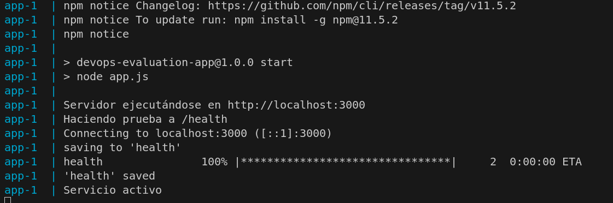

# ArquitecturaSFV-P1

# Evaluación Práctica - Ingeniería de Software V

## Información del Estudiante
- **Nombre: Raul Quigua** 
- **Código: AA00399891**
- **Fecha: 6/AGO/2025**

## Resumen de la Solución
Cree una imagen de la app la cual es un servicio de express, la gestiono mediante un entrypoint y la construcción de la imagen funciona a través de un script.sh

## Dockerfile
Al ser una aplicación tan sencilla solo tomé una versión ligera de node (alpine) y le doy permisos al entrypoint.

## Script de Automatización
El entrypoint de la app instala las dependencias de node, ejecuta el serviicio y luego espera 5 segundos para hacer la prueba con wget al endpoint /healt. Y el script lo qu hace es verificar que la máquina que quiere construir la imagen tiene docker instalado y luego costruye la image y levanta el contenedor.

## Principios DevOps Aplicados
1. Automatización
2. Pipeline de levntar servicios
3. Imágen liviana usando alpine

## Captura de Pantalla
[Incluye al menos una captura de pantalla que muestre tu aplicación funcionando en el contenedor]

## Mejoras Futuras
El uso innecesario de docker-compose

## Instrucciones para Ejecutar
chmod +x script.sh

./script.sh